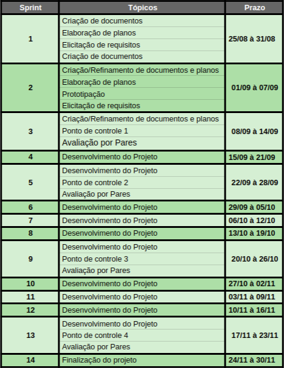

# Gerenciamento do Cronograma do Projeto

## Introdução

      Segundo o Guia PMBOK®, o gerenciamento do cronograma do projeto inclui os processos necessários para gerenciar o término pontual do projeto.O gerenciamento do cronograma aborda os processos de planejar o gerenciamento do cronograma, definir as atividades, sequenciar as atividades, estimar a duração das atividades, desenvolver o cronograma, controlar o cronograma. [1]

## Metodologia

    O documento será dividido em tópicos que representam os processos de gerenciamento do cronograma  para o projeto.

- Planejar o Gerenciamento do Cronograma:  
    Serão estabelecidos os processos de políticas, procedimentos, documentação para o planejamento, desenvolvimento, gerenciamento, execução e controle do cronograma do projeto. [1]

-  Definir as Atividades:  
  As tarefas serão identificadas e documentadas para produzir as entregas do projeto.[1]

-  Sequenciar as Atividades  
    Processo de identificar e documentar os relacionamentos entre as atividades do projeto.[1]

-  Estimar as Durações das Atividades:  
    Estimar o tempo de trabalho necessário para terminar atividades individuais com os recursos estimados
    
-  Desenvolver o Cronograma:  
    analisar as sequências de atividades, durações, requisitos de recursos e restrições de cronograma para criar o modelo de cronograma do projeto para execução, monitoramento e controle do mesmo. [1]
    
- Controlar o Cronograma:  
    O processo de monitorar o status do projeto para atualizar o cronograma do projeto e gerenciar mudanças na linha de base do mesmo.[1]

## Desenvolvimento

### Versão 1.0

### Planejar o Gerenciamento do Cronograma

O escopo do Projeto é definido a partir do cronograma estipulado pela disciplina de arquitetura e desenho de software, A partir das atividades determinadas pelo cronograma da matéria será possível elaborar um cronograma para o projeto.

### Definir as Atividades:

A partir da definição do escopo do projeto é possível dividi-lo em entregas menores, mais fáceis de gerenciar, assim determinar tarefas(atividades) para concluir,desenvolver, cada parte do escopo

### Sequenciar as Atividades:

As tarefas serão sequenciadas a partir dos módulos do escopo, definidos na disciplina, com nível de hierarquia de importância e dependência entre as atividades.

### Estimar as Durações das Atividades:

As durações das atividades serão definidas em reuniões de planejamento com a equipe, com critérios específicos como: complexidade da atividade, capacidade de entrega da equipe e duração de um ciclo de entrega (Sprint).

### Desenvolver o Cronograma

Com atividades definidas para cada módulo do escopo é possível elaborar um cronograma sequencial,de acordo com as datas de entregas da disciplina, e com a metodologia que será utilizada pela equipe durante o projeto.

#### Cronograma estipulado:

### Controlar o Cronograma:

O monitoramento do cronograma será feito constantemente durante cada sprint com o intuito de averiguar o andamento do projeto e realizar mudanças se necessário.

## Conclusão

    O gerenciamento do cronograma permite manter a equipe informada sobre as atividades,entregas e iterações. Determinando o quê deve ser entregue e o prazo.

 
## Referências

> [1] PMI. Um guia do conhecimento em gerenciamento de projetos. Guia PMBOK 5a. ed. - EUA: Project Management Institute, 2013.

## Autor(es)

| Data | Versão | Descrição | Autor(es) |
| -- | -- | -- | -- |
| 02/09/20 | 1.0 | Criação do documento | João Pedro e Moacir Mascarenha | 