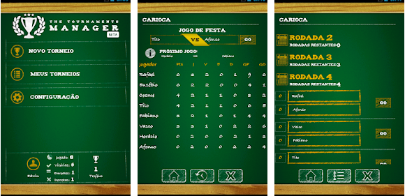
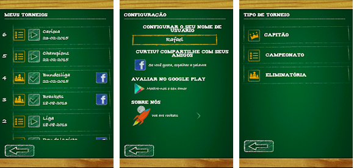

## Introdução

A observação é uma técnica de avaliação de como o usuário interage com um sistema para realizar tarefas. Através da anotação dos dados registrados, é possível identificar problemas que os usuários encontram ao utilizar com o sistema. Além disso, é possível elicitar requisitos que corrigam ou que amenizem os problemas encontrados.
A observação participante é uma variação da técnica onde o observador assume uma posição ativa (utilizando o sistema), e analisa o sistema de acordo com determinados aspectos, com o intuito de encontrar dificuldades ao realizar tarefas.

## Metodologia

Para a utilização dessa técnica, dois membros da equipe realizaram a observação de aplicações com objetivos semelhantes ao projeto (gerência e organização de torneios e competições).

Aspectos considerados:

- Facilidade de uso (o usuário tem alguma dificuldade em realizar tarefas?)
- Eficiência (faz rápidamente o que o cliente quer?)
- Corretude (faz o que o cliente quer?)

Tarefas analisadas:
- Criar torneio
- Editar torneio
- Ver informações do torneio

## Avaliação de aplicações
### Versão 1.0
### Aplicativos observados:
- [Gerenciador de Torneio (by braubrau)](https://play.google.com/store/apps/details?id=rockets.thetournamentmanager&hl=pt_BR)

#### Avaliação 1 (Gerenciador de Torneio):

- Criar torneio:
    
    - Passos:        
        1 - Clicar em criar torneio 
        2 - Adcionar nome ao torneio 
        3 - Inserir número de jogadores 
        4 - Clica em avançar 
        5 - Inserir os nomes de cada jogador 
        6 - Clica em avançar 
        7 - Escolher o tipo de torneio (optamos por campeonato neste exemplo) 

    - Análise:
        - Facilidade de uso: 
        A tarefa foi facilmente realizada, porém alguns aspectos poderiam ser melhores. Por exemplo, a forma de inserir jogadores (passo 3) é muito ineficiente, sendo necessário clicar uma vez por jogador, sendo um problema caso necessário adicionar muitos jogadores. 
        - Eficiência:  A tarefa é realizada rapidamente para poucos jogadores, mas ao aumentar o número de jogadores, o tempo para se inserir o nome de todos os jogadores (passo 5) se torna muito grande, então a eficiência da tarefa foi satisfatória para campeonatos pequenos, mas mediana para campeonatos grandes. 
        - Corretude:  A tarefa fez exatamente o que deveria e o que foi esperado pelo usuário, então sua corretude é satisfatória. 

- Adicionar dados de partida:
    
    - Passos:        
        1 - Clicar em Meus Torneios 
        2 - Escolher o torneio desejado 
        3 - Clicar em 'Go' (jogo de festa) 
        4 - Informar placar 
        5 - Clicar em 'End the match'

    - Análise:
        - Facilidade de uso: 
        A tarefa não é totalmente clara (intuítiva) com os termos e palavreados, além da funcionalidade não estar devidamente destacada.  
        - Eficiência: 
        A forma de informar placar (passo 4) é muito trabalhosa, pois para cada ponto deve-se clicar em nos botões '+' ou '-', e não há a opção de informar o placar final. Em uma partida com muitos pontos (exemplo: basquete), seria demorado finalizar a tarefa. 
        - Corretude: A tarefa fez exatamente o que deveria e o que foi esperado pelo usuário, então sua corretude é satisfatória.  
        
- Ver informações do torneio:
    - Passos:        
        1 - Clicar em Meus Torneios 
        2 - Escolher o torneio desejado 

    - Análise:
        - Facilidade de uso: 
        A tarefa é bastante simples e intuitiva, sua usabilidade é muito boa. 
        - Eficiência: 
        A tarefa é extremamente eficiênte, sendo necessários apenas dois cliques para ter uma visão geral do torneio. 
        - Corretude: A tarefa fez exatamente o que deveria e o que foi esperado pelo usuário, então sua corretude é satisfatória.  

## Requisitos Elicitados

|ID|Descrição|
|--|--|
|OBS01|O gerenciador deve escolher os tipos de torneio|
|OBS02|O gerenciador deve personalizar suas próprias regras de torneio|
|OBS03|Os jogadores devem solicitar para entrar em torneios|
|OBS04|O gerenciador do torneio deve ter uma lista de todas as solicitações de jogadores para entrar no torneio|
|OBS05|O gerenciador do torneio deve poder aceitar ou recusar solicitação de jogadores para entrar|
|OBS06|O gerenciador do torneio deve poder aceitar todos as solicitações com apenas 1 clique|
|OBS07|O gerenciador deve adicionar dados (placar, status da partida, etc) de uma partida de maneira simples e rápida|
|OBS08|O gerenciador deve ter a opção de digitar o placar final|
|OBS09|A interface deve conter ícones, botões e descrições claros, intuitivos e objetivos|
|OBS10|Os dados (não sensiveis) do campeonato devem poder ser vistos por todos os usuários (gerenciadores, jogadores e não-participantes)|
|OBS11|Os dados do campeonato devem ser facilmente acessados|

## Conclusão

A técnica de observação é uma poderosa ferramenta para elicitar requisitos e previnir problemas gerais para o projeto. Após analisar aplicações com propósitos semelhantes, foi possível elicitar requisitos e ter uma noção de como a aplicação funcionará, com algumas tarefas sendo imaginadas e planejadas.

## Referências
> BARBOSA, S. D. J; DA SILVA, B. S. Interação humano-computador. Elsevier, 2010.

> NAIK, K; TRIPATHY, P. SOFTWARE TESTING AND QUALITY ASSURANCE: THEORY AND PRACTICE. John Wiley & Sons, 2010

> TIPOS DE OBSERVAÇÃO SEGUNDO CRITÉRIOS ESPECÍFICOS,  disponivel em: https://monografias.brasilescola.uol.com.br/regras-abnt/tipos-observacao-segundo-criterios-especificos.htm

> Gerenciador de Torneio, disponivel em: https://play.google.com/store/apps/details?id=rockets.thetournamentmanager&hl=pt_BR

## Autor(es)
| Data | Versão | Descrição | Autor(es) |
| -- | -- | -- | -- |
| 30/08/20 | 1.0 | Criação do documento | Moacir Mascarenha e Renan Cristyan |
| 11/09/20 | 1.1 | Correções e adição das imagens e referências do aplicativo gerenciador de torneio | Moacir Mascarenha | 
