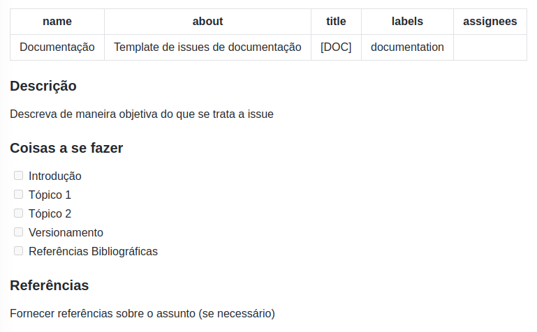

## Introdução

<p align = "justify">
O Plano de Gerenciamento de Configuração detalha o planejamento de atividades, as responsabilidades designadas e os recursos necessários para o projeto.
</p>

## Metodologia

<p align = "justify">
O documento é dividido em  Políticas de Commits, Políticas de Branchs e Política de Aprovação, para a produção deste artefato usamos informaçoes de referencia e tambem na experiencia da equipe com os temas. Além disso, foi utilizado o Google Hangouts para videoconferência e Visual Studio Code / Live Share para elaboração da documentação.
</p>

## 

### Versão 1.0

### Políticas

<br/>

- **Políticas de Commits**

<p align = "justify">
Os <i>commits</i> O commit deve ser escrito de uma maneira simples e tambem devem ser atômicos. O texto dos commits deve descrever o que foi prouzido, de forma resumida, sem acentuação, com o tempo verbal no particípio. Além disso, deve conter o número de sua <i>issue</i> correspondente, no seguinte formato:
</p>

**Repositorio de Documentação**

```[#<id da issue>] < Texto com verbo no particípio>.```

**Exemplo:**

```[#01] Criado Documento```

**Outos Repositorios**

```[<Tag da issue>] <Texto com verbo no particípio>.```

**Exemplo:**

```[US00] Criada funcionalidade.```

<br/>

- **Políticas de Branchs**
  
 [](../assets/diagrama_gcs/branchs.png)

 *Imagem tirada da referencia [2]*

O repositório do projeto terá uma branch master, sendo ela a branch estável.

Nenhum membro será autorizado a fazer commits diretamente na master. Cada atividade deve ter uma branch auxiliar propria,criada a partir da master. Os membros devem solicitar via pull requests atualizações na master.

``` <Identificador da atividade>-<Nome issue associada a atividade>```

**Exemplos:**

```US01-fazer-login```

Após o fim do desenvolvimento nas branches auxiliares elas devem ser incorporadas a master por meio de pull request.


- **Política de Aprovação**

Para a aprovação do código, o pull request deve ser revisado por ao menos 1 membro da equipe que não esteja envolvido na tarefa, as branch e dos commits devem estar de acordo com o definido, a build não pode apresentar erros, e assim a tarefa será aprovada.

## Uso de Issues

<p align = "justify">As issuesserão criadas com o objetivo de descrever e rastrear as tarefas desenvolvidas pela equipe durante o projeto.</p>

<p align = "justify">As issues vão conter identificadores, para que se possa indicar de qual tarefa se trata. Os identificadores definidos para o projeto serão:</p>

* **[Doc]** - Utilizado para as issues que representam Documentos.
* **[EPIC]** - Utilizado para as issues que representam épicos.
* **[FT]** - Utilizado para as issues que representam <i>features</i>.
* **[US]** - Utilizado para as issues que representam histórias de usuário.
* **[BUG]** - Utilizado para <i>issues</i> que representam correção de <i>bugs</i>.

- formato padrão das issues: 

[](../assets/diagrama_gcs/template_issue.png)

## Ferramentas

| Ferramenta | Descrição |
|:----:|:---------:|
| Git | Ferramenta de versionamento |
| GitHub | Ferramenta de hospedagem de repositórios |
| ZenHub | Ferramenta de gerenciamento de equipe |
| React | Ferramenta de criação de interface de usuário |
| NodeJS | Ferramenta para criação de API's | 
| Docker | Ferramenta de virtualização e configuração de ambiente por meio de containers | 
| Docker Compose | Ferramenta de gerenciamento de containers Docker | 
| Github actions | Ferramenta de integração contínua | 
| VS Code | Ferramenta de edição de código fonte |
| Slack e whatsapp | Ferramenta de comunicação do grupo |

## Conclusão

<p align = "justify">

</p>

## Referências

> [1] Semantic Versioning 2.0.0 . Semantic Versioning Specification (SemVer). Disponível em <http://semver.org/>

> [2] https://mikedecr.github.io/teaching/computing-811/slides/08_git/08_git-intro.html#1

> [3] PMI®
. PMBOK®
: Um Guia do Conhecimento em Gerenciamento de Projetos (Guia PMBOK)/Project Management Institute.Sexta. Pensilvânia 19073-3299 EUA
## Autor(es)

| Data | Versão | Descrição | Autor(es) |
| -- | -- | -- | -- |
| 25/10/20 | 1.0 | Criação do documento | João Pedro e Lucas Alexandre |