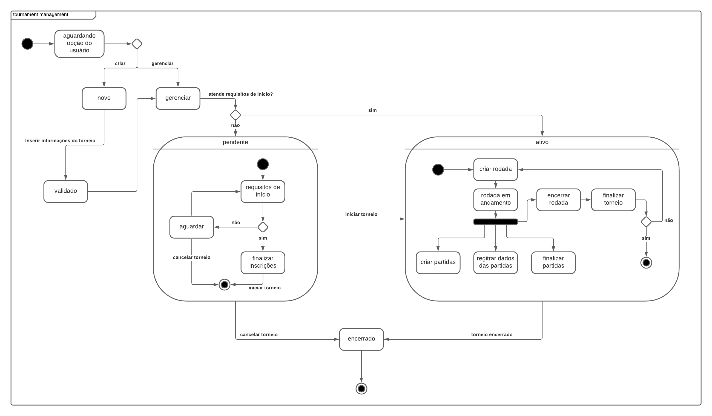
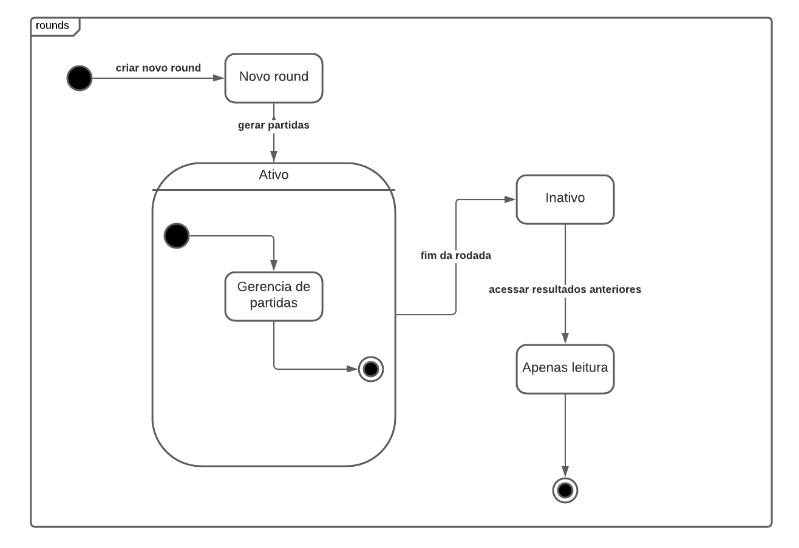
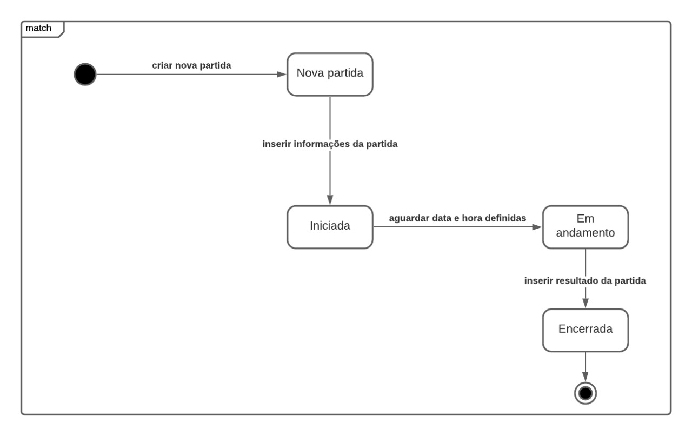

## Introdução

O diagrama de estados busca representar as várias transições de estados que uma determinada parte do sistema pode passar. Ao decorrer da execução do sistema, os estados podem variar quando ocorrem eventos internos ou externos. O diagrama de estados visa documentar estas variações.

## Metodologia

Inicialmente, buscou-se identificar as partes ou processos do sistema a serem ilustrados. Depois, procuramos os estados associados aquele contexto e suas variações, dependendo de eventos internos ou externos. Assim, pudemos representar um conceito bastante abstrato na forma de um diagrama que pode ser utilizado para referências futuras.

Foi utilizado os softwares Lucidchart e Draw.io para a implementação dos diagramas, Google Hangouts para videoconferência, Google Drive para compartilhamento de imagens e Visual Studio Code com extensão Live Share para elaboração do documento.

## Diagramas

### Versão 1.0

#### Gerenciamento de torneio

#### Rodada

#### Partida

## Conclusão

## Referências

<!-- Insira referências relevantes do projeto (com um sinal de '>' antes), se possível priorize por livros e artigos, depois sites, blogs e outros projetos parecidos.
Exemplo:
> Referência
 -->

>

## Autor(es)
| Data | Versão | Descrição | Autor(es) |
| -- | -- | -- | -- |
| 27/09/20 | 1.0 | Criação do documento | Moacir Mascarenha e Renan Cristyan | 