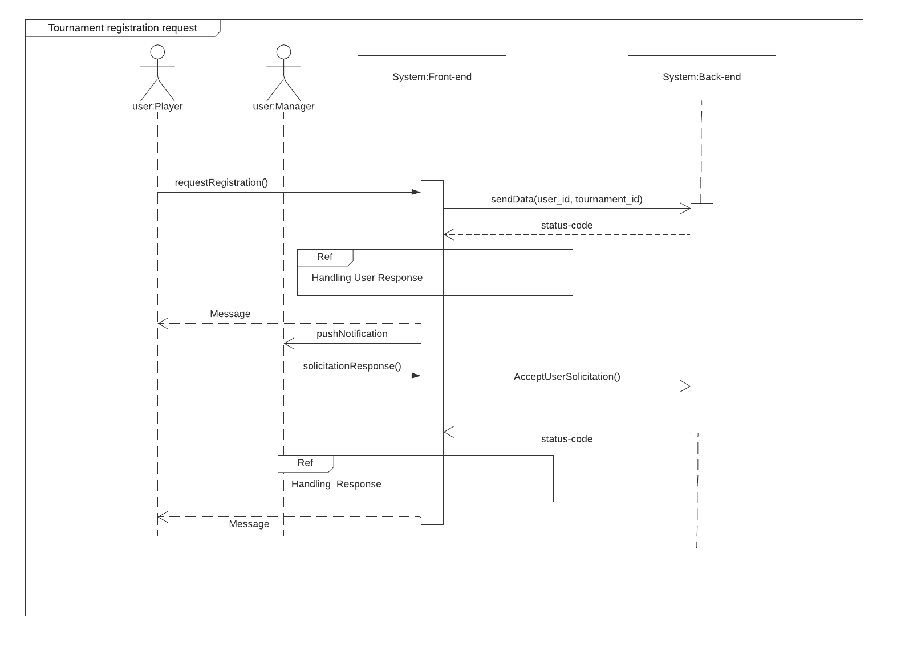

## Introdução

O diagrama de sequência é utilizado principalmente para ilustrar as interações entre objetos em uma ordem sequencial em que essas interações ocorrem, descrevendo uma interação focado na sequência de mensagens, junto com suas especificações de ocorrência correspondentes nas linhas de vida.

## Metodologia

Foi utilizado o <a href='http://lucidchart.com'>Lucidchart</a> para a elaboração do diagrama de sequência, também foi usado a plataforma Hangouts, da Google, para realização da videoconferência para discussão da estrutura do diagrama, Visual Studio Code com extensão liveshare para confecção do documento.

## Diagramas

### Versão 1.0
### Criação de torneio

](../assets/Diagrama_sequencia/sequencia1.png)

### Solicitação de inscrição no torneio
](../assets/Diagrama_sequencia/sequencia2.png)

## Conclusão

<!-- Descreva neste tópico como a aplicação da técnica e a criação do documento foi útil para o projeto. -->

## Referências

<!-- Insira referências relevantes do projeto (com um sinal de '>' antes), se possível priorize por livros e artigos, depois sites, blogs e outros projetos parecidos.
Exemplo:
> Referência
 -->

>

## Autor(es)
<!-- Para cada alteração no documento, lembre-se de descrever as mudanças, a versão, a data e creditar os autores. -->
| Data | Versão | Descrição | Autor(es) |
| -- | -- | -- | -- |
| 26/09/2020 | 1.0 | Criação do documento | Moacir Mascarenha e Matheus Estanislau | 