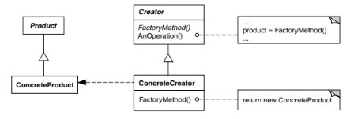
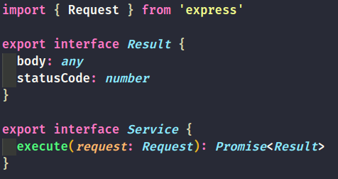
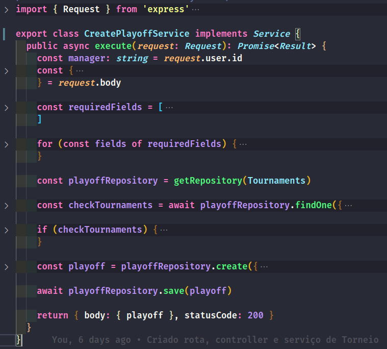
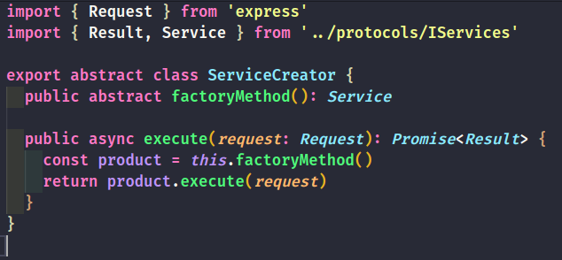
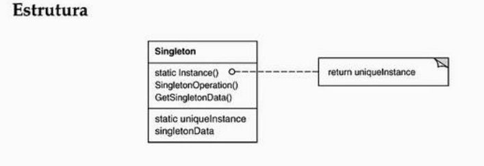

 
## Introdução
 

Os padrões de criação fornece vários mecanismos de criação de objetos, delegando a instanciação para outro objeto, que aumentam a flexibilidade, independência do sistema e reutilização de código já existente.

 
 
## Metodologia
 

A partir do estudo da equipe sobre os padrões criacionais e feedback das avaliações, a equipe analisou os diagramas identificando problemas onde os padrões poderiam ser aplicados.

 
## Padrões
 
### Versão 1.0
 
### Factory Method
 

O Factory Method (Método fábrica, Construtor virtual) é um padrão criacional de projeto que fornece uma interface para criar objetos em uma superclasse, mas permite que as subclasses alterem o tipo de objetos que serão criados.
 

 

 
#### Motivação
O sistema inicialmente estava projetado para torneios apenas do tipo playoffs, dificultado adições de novos tipos de torneios como o de [barragem](../). Foi usado o padrão Factory Method para flexibilizar o sistema, sendo possível atualizações futuras sem grandes mudanças na base de código.
 
#### Aplicação no projeto
 

 
Na implementação do backend utilizamos o factory method na implementação de nossos serviços.
 
Inicialmente foi implementada uma interface onde todos os serviços passaram a seguir esse protocolo.
 

 
Os serviços concretos foram criados a partir da implementação do protocolo de serviço.
 
Exemplo do serviço de playoffs:
 

 
A fábrica de serviços foi implementada com o método factoryMethod que pode ser sobrescrito pelas suas subclasses que serão os criadores concretos dos serviços:
 

 
Os criadores concretos dos serviços estendem da fábrica de serviços e sobrescrevem o método factory Method retornando uma nova instância de um serviço concreto:
 

 
 
### Singleton

O padrão de projeto criacional permite garantir que uma classe tenha apenas uma instância

 

 
#### Motivação

Para a utilização do banco de dados é necessário criar uma conexão, onde a partir desta conexão toda a aplicação passa a ter acesso a essa única instância.

 
#### Aplicação no projeto
 

 
 
## Conclusão
 

Após a implementação dos padrões criacionais foi possível notar uma flexibilização do sistema, para possíveis expansões e manutenções futuras sem grandes impactos ao sistema.

 
## Referências
 
> [1] PADRÕES de PROJETO. Disponível em: https://refactoring.guru/pt-br/design-patterns
 
> [2] GAMMA, Erich et al. Design Patterns: Elements of Reusable Object-Oriented Software. 1. ed. Massachusetts: Addison-Wesley Professional, 2009. 426 p. ISBN 0-201-63361-2.
 
## Autor(es)
 
| Data | Versão | Descrição | Autor(es) |
| -- | -- | -- | -- |
| 18/10/20 | 1.0 | Criação do documento | João Pedro e Moacir Mascarenha |
| 18/10/20 | 1.1 | Adicionado Padrão Factory Method | João Pedro, Matheus Estanislau, Moacir Mascarenha |
| 19/10/20 | 1.2 | Atualizada imagem do padrão Factory Method | Renan Cristyan |
| 25/10/20 | 1.3 | Adicionado padrão singleton | Moacir Mascarenha |
| 26/10/20 | 1.4 | Adicionado implementação do factory method | Matheus Estanislau |
| 26/10/20 | 1.5 | Correções no documento | João Pedro, Lucas Alexandre, Matheus Estanislau, Renan Cristyan |
 
 

