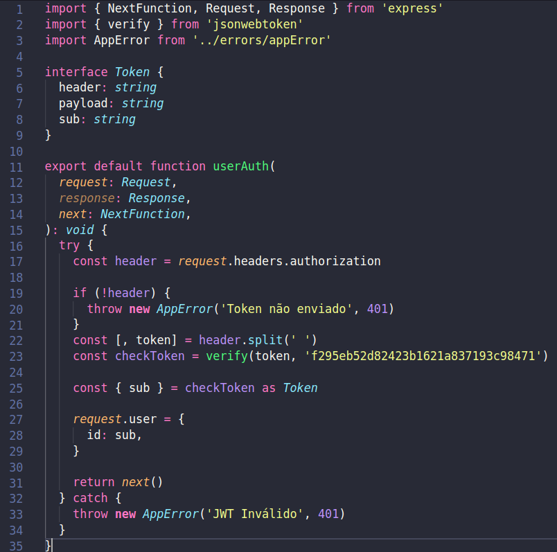
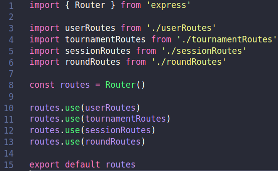

## Introdução

Os padrões estruturais se preocupam com a forma como classes e objetos são compostos para formar estruturas maiores.mas ainda mantendo essas estruturas flexíveis e eficientes. Os de classes utilizam a herança para compor interfaces ou implementações, e os de objeto ao invés de compor interfaces ou implementações, eles descrevem maneiras de compor objetos para obter novas funcionalidades [3].

## Metodologia

 A partir do estudo da equipe sobre os padrões estruturais e feedback das avaliações, a equipe analisou os diagramas identificando problemas onde os padrões poderiam ser aplicados. A partir desses padrões identificados, a equipe os implementou.

## Padrões Estruturais

### Versão 1.0

#### Facede

O Facade é um padrão de projeto estrutural que fornece uma interface simplificada para uma biblioteca, um framework, ou qualquer conjunto complexo de classes [1].

#### Motivação

É importante uma autenticação nas rotas para evitar que o usuário acesse rotas que não esteja autorizado. Então a equipe optou pelo padrão facade para autenticação, servindo como fachada para acesso as rotas.

#### Aplicação no projeto

A imagem a baixo representa uma facade de autenticação de usuário, que é usada para um controle de acesso as rotas. Para acessar todas as rotas necessita desta interface, indicando que o usuário está logado ou não na aplicação.

A imagem a baixo mostra um exemplo do uso da facede de autenticação para acesso a rota de round. que esta incluido no arquivo roundRoutes.ts

#### Proxy 

O Proxy é um padrão de projeto estrutural que permite que você forneça um substituto ou um espaço reservado para outro objeto. Um proxy controla o acesso ao objeto original, permitindo que você faça algo ou antes ou depois do pedido chegar ao objeto original [1]. 

#### Motivação

Foi usado o padrão Proxy para gerenciar os requests enviados da camada de view, interceptando estes requests e assim formando um middleware que faz o encaminhamento para sua respectiva rota.

#### Aplicação no projeto

A imagem mostra o uso do padrão proxy para interceptar as request e encaminhas as rotas.

## Conclusão

## Referências

> [1]PADRÕES de PROJETO. Disponível em: https://refactoring.guru/pt-br/design-patterns 

> [2]GAMMA, Erich et al. Design Patterns: Elements of Reusable Object-Oriented Software. 1. ed. Massachusetts: Addison-Wesley Professional, 2009. 426 p. ISBN 0-201-63361-2.

> [3] CONHEÇA OS PADRÕES DE PROJETO. Disponível em: https://www.devmedia.com.br/conheca-os-padroes-de-projeto/957

## Autor(es)

| Data | Versão | Descrição | Autor(es) |
| -- | -- | -- | -- |
| 24/10/20 | 1.0 | Criação do documento | João Pedro e Lucas Alexandre |
|24/10/20| 1.1 | Adicionado padrão facade | João Pedro, Lucas Alexandre e Matheus estanislau|
|24/10/20| 1.2 | Adicionado padrão Proxy | João Pedro, Lucas Alexandre e Matheus estanislau|
