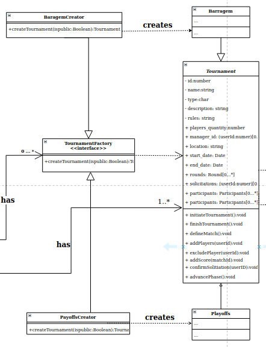
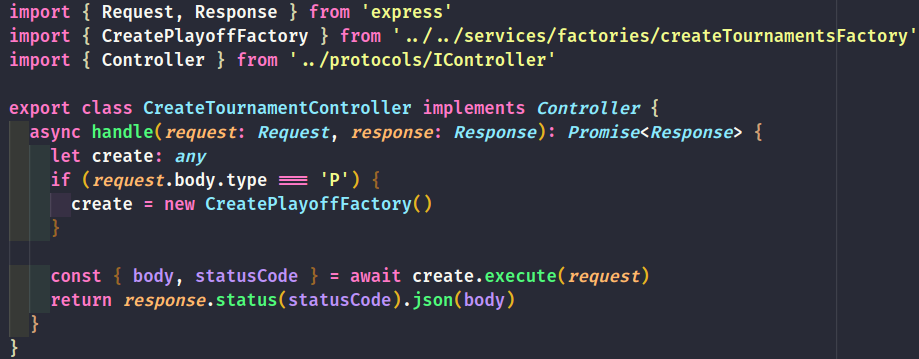
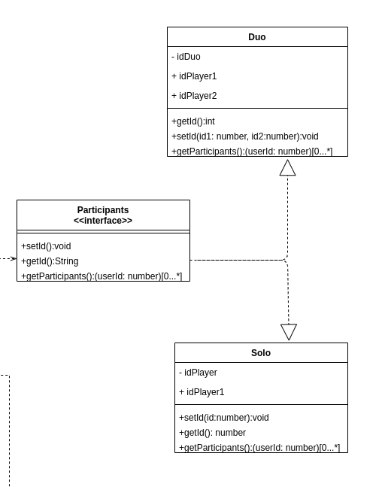

 
 
## Introdução
 

Os padrões GRASP (General Responsibility Assignment Software Patterns) consistem em uma série de princípios baseados em conceitos para atribuição de responsabilidades a classes e objetos na construção de bons softwares usando programação orientada a objetos. Os padrões GRASP buscam disponibilizar recomendações que procuram auxiliar na obtenção de sistemas melhor estruturados e de fácil manutenção.

 
## Metodologia
 

A partir do estudo da equipe sobre os padrões de projeto (GRASP e GoFs) e feedback das avaliações, foi identificado os problemas onde os padrões podem ser aplicados. Os padrões que foram identificados no projeto foram documentados e foram fornecidas as descrições de suas aplicações.

 
## Padrões
 
### Versão 1.0
 
### Creator
 

Determina qual classe deve ser responsável pela criação certos objetos. Atribua à classe B a responsabilidade de criar uma instância de A se pelo menos um desses for verdadeiro:
 
- B contém ou agrega A
- B registra a existência de A
- B usa A
- B tem os dados necessários para a inicialização de A que
serão passados ao construtor de A.

 
#### Aplicação no projeto
O uso deste padrão foi incorporado ao padrão factory method exemplificado no documento [GOFs Criacionais](./gof_criacionais.md). Em resumo, as classes Tournament Factory, BarragemCreator e PlayoffsCreator tem apenas responsabilidades de instanciar objetos de outras classes.
 

 
### Coesão

Coesão mede o quanto as responsabilidades de um elemento, seja classe, objeto ou subsistema, são fortemente relacionadas e altamente focadas.
 
Objetos com alta coesão: são aqueles que possuem apenas responsabilidades que estão relacionadas e não possuem uma carga excessiva de trabalho.
 
Objetos com baixa coesão: são aqueles que possuem uma carga elevada de responsabilidades que não estão relacionadas.

 
#### Aplicação no projeto
 

O padrão de coesão foi utilizado em todo sistema do backend, utilizando classes coesas contento apenas responsabilidades inerentes ao seu papel dentro da aplicação.

 
Exemplo da aplicação:
 

 

 
 
### Especialista

O padrão GRASP especialista é uma abordagem que visa atribuir a responsabilidade de algo para uma classe específica, no caso, o especialista.

 
#### Aplicação no projeto
O padrão especialista foi identificado em algumas partes do projeto. Por exemplo, as classes FriendlyMatch, BarragemMatch e PlayoffsMatch são classes especialistas, pois cada uma representa um tipo específico de partida.
 

 
### Polimorfismo

As responsabilidades devem ser atribuídas a abstrações e não a objetos concretos, permitindo que eles possam variar conforme a necessidade.

 
#### Aplicação no projeto
É possível identificar o padrão polimorfismo em várias classes do [diagrama de classe](../modelagem/diagrama_de_classes.md).
 

 
É possível identificar o uso deste padrão incorporado em vários padrões GOFs, como: [GOFs Criacionais](./gof_criacionais.md).
 
 
### Controller
 

O padrão controller determina que a responsabilidade da manipulação de eventos deve permanecer fora da interface com usuário, ela também distribui responsabilidades entre as demais classes do sistema, funciona como fachada do sistema retornando mensagens ao cliente

 
##### Aplicação no projeto
 
Utilizamos o padrão de projeto Controller em nosso backend distribuindo a manipulação de eventos para os serviços responsáveis, no projeto será utilizado a controller de Usuário, Sessão, Torneio, Rounds e Partidas.
 
### Indirection
 

O padrão indirection suporta baixo acoplamento entre dois elementos, atribuindo a objeto intermediário a responsabilidade de ser o mediador entre eles. Um exemplo é a introdução do componente controlador para mediação entre modelo.

 
#### Aplicação no projeto
É possível identificar o padrão indirection no diagrama de sequência onde há baixo acoplamento entre a componente de registrar torneio e o repository do torneio. A controller e a service são dois intermediadores entre eles
 

 
 
## Conclusão
 

A partir do estudo e aplicação dos padrões GRASP, a equipe pode observar boas práticas e técnicas interessantes para se aplicar no projeto.

 
## Referências
 
 
> Padrões GRASP. Disponível em: http://www.facom.ufu.br/~bacala/ESOF/05a-Padr%C3%B5es%20GRASP.pdf
 
> Understanding the GRASP Design Patterns. Disponível em: https://medium.com/@ReganKoopmans/understanding-the-grasp-design-patterns-2cab23c7226e
 
> Padrões GRASP. Disponível em: http://www.facom.ufu.br/~bacala/ESOF/05a-Padr%C3%B5es%20GRASP.pdf
 
> Padrão GRASP Controller. Disponível em: https://www.ramonsilva.net/post/controller-padr%C3%B5es-grasp
 
## Autor(es)
 
| Data | Versão | Descrição | Autor(es) |
| -- | -- | -- | -- |
| 18/10/20 | 1.0 | Criação do documento | João Pedro e Moacir Mascarenha |
| 18/10/20 | 1.1 | Adicionado padrão creator | João Pedro, Matheus Estanislau e  Moacir Mascarenha |
| 18/10/20 | 1.2 | Adicionado padrão polimorfismo | João Pedro, Matheus Estanislau e  Moacir Mascarenha |
| 18/10/20 | 1.3 | Adicionado padrão controller | João Pedro, Matheus Estanislau e  Moacir Mascarenha |
| 19/10/20 | 1.4 | Ajustes no documento | Renan Cristyan |
| 19/10/20 | 1.5 | Adicionado padrão especialista | Renan Cristyan |
| 24/10/20 | 1.6 | Adicionado padrão indirection | Lucas Alexandre e João Pedro|
|25/10/20| 1.7| Adicionado padrão coesão| Lucas Alexandre e Matheus Estanislau|
|26/10/20| 1.7| Adicionado padrão coesão| Lucas Alexandre e Matheus Estanislau|
| 26/10/20 | 1.8 | Correções no documento | João Pedro, Lucas Alexandre, Matheus Estanislau, Renan Cristyan |
|26/10/20| 1.9 | Adicionada conclusão | Renan Cristyan |
 
 

