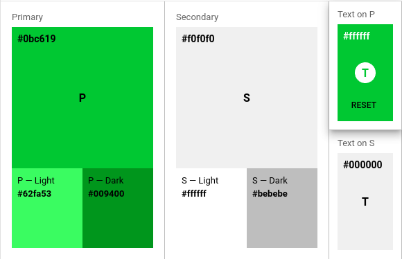

## Introdução

<p align = "justify">
O Guia de Estilo tem o objetivo de estabelecer padrões dentro do projeto , definindo regras e diretrizes que visam garantir a consistencia da criação do desenho da interfance com o usuário, também tem como objetivo organizar e padronizar o estilo do código fornencendo uma maior legibilidade e compreensividade.
</p>

## Metodologia

<p align = "justify">
A equipe decidiu por usar o padrão de estilo da biblioteca do <a href="https://material-ui.com">Material Ui</a> para os componentes da aplicação e para as regras de interface. Para o estilo do código foi decidido utilizar a bilioteca de lint <a href="https://eslint.org/">Eslint</a> com o padrão estabelicdo pela <a href="https://github.com/airbnb/javascript">Airbnb</a> Para a criação do documento, a equipe utilizou o Google Hangouts para videoconferência e Visual Studio Code / Live Share para elaboração da documentação.
</p>

## Guia de estilo

### Versão 1.0

### Javascript 
Para a padronização de código utilizamos a biblioteca eslint com o padrão da airbnb, porém algumas alterações foram definidas pela equipe, assim utilizamos um script do eslint para que essa padronização seja verificada em todo o codigo, quando alguma alteração é feita. Caso as regras de estilo do codigo não sejam atendidas o a inserção do codigo será negada.

### Intaface

#### Paleta de cores



Para representação dos erros utilizar seguintes cores:

```
error:
light: 
#e57373
main: 
#bd2020
dark: 
#d32f2f
contrastText: 
#fff
```

#### Tipografia
Utilizar tipografia padrão do material UI que vão desde o h1 até o body2

```
fontFamily: ""Roboto", "Helvetica", "Arial", sans-serif"
h1
h2
h3
h4
h5
h6
subtitle1
subtitle2
body1
body2
```

#### Sombreamento
Utilizar os padrões do material UI que vão do 0 ao 5:
```
shadows:
0: "none"
1: "0px 2px 1px -1px rgba(0,0,0,0.2),0px 1px 1px 0px rgba(0,0,0,0.14),0px 1px 3px 0px rgba(0,0,0,0.12)"
2: "0px 3px 1px -2px rgba(0,0,0,0.2),0px 2px 2px 0px rgba(0,0,0,0.14),0px 1px 5px 0px rgba(0,0,0,0.12)"
3: "0px 3px 3px -2px rgba(0,0,0,0.2),0px 3px 4px 0px rgba(0,0,0,0.14),0px 1px 8px 0px rgba(0,0,0,0.12)"
4: "0px 2px 4px -1px rgba(0,0,0,0.2),0px 4px 5px 0px rgba(0,0,0,0.14),0px 1px 10px 0px rgba(0,0,0,0.12)"
5: "0px 3px 5px -1px rgba(0,0,0,0.2),0px 5px 8px 0px rgba(0,0,0,0.14),0px 1px 14px 0px rgba(0,0,0,0.12)"
```

#### Pontos de Quebra

Os pontos de quebras das telas:

```
keys: 
0: "xs"
1: "sm"
2: "md"
3: "lg"
4: "xl"
values:
xs: 0
sm: 600
md: 960
lg: 1280
xl: 1920
```

#### Bordas

Utilizar padrão estipulado de 5px utilizado no protótipo

```
borderRadius: 5
```


## Conclusão

<p align = "justify">
Após a elaboração do documento a equipe possui uma padronização da interface e do código, a equipe deve seguir os padrões para uma melhor consistencia e qualidade do software, evitando fugas de estilo e mantendo a coesão e legibilidade do código. 
</p>

## Referências

>Guia de Estilo de Usabilidade do Software. Disponivel em: https://homepages.dcc.ufmg.br/~clarindo/arquivos/disciplinas/eu/material/exemplos/geusw-exemplo-incompleto.pdf

>Biblioteca de componentes React para um desenvolvimento ágil e fácil. Disponivel em: https://material-ui.com/

>Airbnb JavaScript Style Guide. Disponivel em: https://github.com/airbnb/javascript

> Find and fix problems in your JavaScript code. Disponivel em: https://eslint.org/

## Autor(es)
| Data | Versão | Descrição | Autor(es) |
| -- | -- | -- | -- |
| 03/10/20 | 1.0 | Criação do documento | João Pedro, Matheus Estanislau | 
| 03/10/20 | 1.1 | Adicionado regra JavaScript | João Pedro, Matheus Estanislau |
| 03/10/20 | 1.2 | Adicionado regras de Interface | João Pedro, Matheus Estanislau |  
| 03/10/20 | 1.3 | Adicionado conclusão | João Pedro, Matheus Estanislau |  